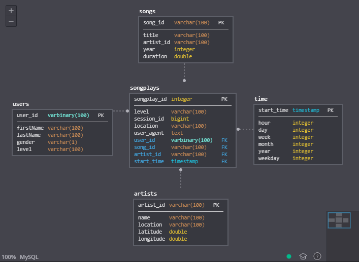

# Project: Sparkify-data-modeling 

## Summary
* [Schema definition](#Schema)
* [Project structure](#Structure)
--------------------------------------------

#### Schema

The songplays table is the core of this schema, is it our fact table and  
it contains foreign keys to four tables;
* start_time REFERENCES time(start_time)
* user_id REFERENCES time(start_time)
* song_id REFERENCES songs(song_id)
* artist_id REFERENCES artists(artist_id)

--------------------------------------------

#### Structure

* <b> /data </b> - Source of the JSON file.
  * <b> /log_data </b> - A folder that contains files of log files in JSON format generated by this [event simulator](https://github.com/Interana/eventsim) based on the songs in the dataset above. These simulate app activity logs from a music streaming app based on specified configurations.
  * <b> /song_data </b> -  Each file is in JSON format and contains metadata about a song and the artist of that song. The files are partitioned by the first three letters of each song's track ID
* <b> etl.ipynb </b> - It is a notebook that helps to know step by step what etl.py does
* <b> test.ipynb </b> - It is a notebook that helps to know if tables
    are created and data are ingested correctly.
* <b> create_tables.py </b> - This script will drop old tables (if exist) ad re-create new tables
* <b> etl.py </b> - This script will process the raw data and ingest them into db.
* <b> sql_queries.py </b> - This file contains SQL queries. 

